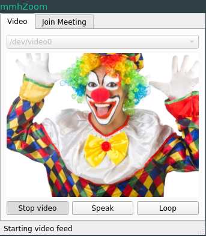

# mmhZoom

Ever wanted to attend/*actively participate* in classes online? Me netiher.



*mmhZoom* is a GUI program designed for Zoom on Linux. You can:

* Loop webcam video (with options to stop/start looping and speaking)
* Automatically join meetings
* Save time attending tedious teleconferencing sessions

Features a (rather basic) meeting manager. Simply add the details of the Zoom meetings you want to join, leave *mmhZoom* open, and you will be automatically connected to the meetings listed.


## Setup

See [setup.md](./setup.md) for installation instructions.

You may also want to allow Zoom to open zoommtg links with your browser:


## Usage

After cloning this repo and following the setup instructions, launch the application:

```sh
$ python3 src/main.py
```

There are two tabs, *Video* and *Join Meeting*.

* Video tab:

	*mmhZoom* creates a loopback camera device ('fake webcam') which you can use as a webcam in Zoom.

	* Click on the dropdown menu on the top and select the device you are using as a webcam
	* Click on *Start Video* to redirect your webcam stream
	* After waiting for a few seconds, the *Loop* button will be enabled. Click on it to loop the video feed.
	* If you need to speak, click on the *Speak* button, which will unmute you and stop the video from looping.

* Join Meeting tab:

	*mmHZoom* saves all inserted meeting details in `$XDG_CONFIG_HOME/mmhZoom/meetings.json` after every modification.
	You won't have to worry about meetings getting lost or reset when you close the application.

	* The region in the middle lists meetings that you have added.
	* Click on *Add Meeting* at the bottom left. Fill in the required details of the meeting you want to add.
	* Select any meeting in the list, then click on *Remove Selected Meeting* to remove it from the list.
	* Double-click on any meeting in the list to edit its details.
